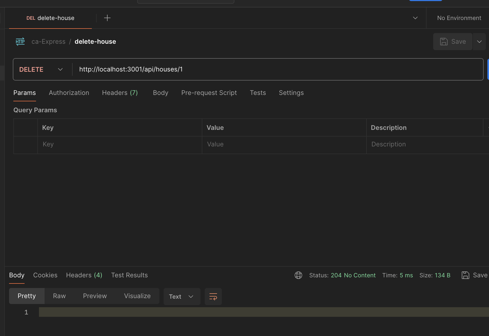
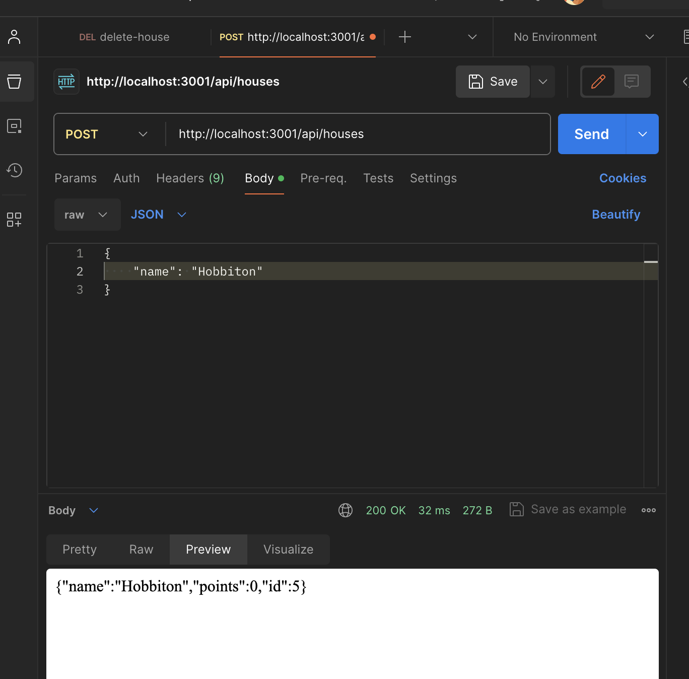

# ca-Express {

## Table of Contents

1. [Introducción](#introduccion)
1. [Servidor web](#servidor-web)
1. [Express](#express)
1. [Servidor web y Express](#servidor-web-y-express)
1. [Nodemon](#nodemon)
1. [REST](#rest)
1. [Obteniendo recurso](#obteniendo-recurso)
1. [Eliminando recurso](#eliminando-recurso)
1. [Recibiendo recurso](#recibiendo-recurso)
1. [Middleware](#middleware)
1. [Documentación](#documentacion)
1. [FAQs](#faqs)
1. [Honorable mentions](#honorable-mentions)

---

## Introducción

> [!NOTE]
> Para aprovechar al máximo este contenido es recomendable haber trabajado con nodejs. Aquí un [enlace](https://github.com/amargopastor-codealong/ca-nodejs) que te puede ser de utilidad.

A lo largo del siguiente contenido, aprenderemos a implementar un pequeño servidor basado en NodeJS que nos ayude a dotar de funcionalidad un proyecto front.

Por norma general, los navegadores necesitar transpilar el código back con herramientas como babel. Por fortuna para nosotros, NodeJS es compatible con las versiones más modernas de JS y podemos usar muchas de sus funcionalidades sin tener que transpilar nuestro código.

En primera instancia, iniciaremos un proyecto backend directamente con npm (sin emplear, por el momento, librerías -herramientas para el desarrollo de aplicaciones- como Vite, Next, React App...):

- Creamos una nueva carpeta
- Iniciamos npm
- Creamos un fichero index.js
- Añadimos el script _"start": "node index.js"_
- Añadimos alguna línea de código a nuestro index.js
- Ejecutamos el comando _npm run start_

```bash
npm init -y
```

> package.json

```json
{
	"name": "backend",
	"version": "1.0.0",
	"description": "",
	"main": "index.js",
	"scripts": {
		"start": "node index.js", // Add start command
		"test": "echo \"Error: no test specified\" && exit 1"
	},
	"keywords": [],
	"author": "",
	"license": "ISC"
}
```

> index.js

```js
console.log('Hello word!');
```

## Servidor web

Vamos a crear, en el componente index.js, un servidor inicial.

> index.js

```js
// Importamos el servidor web integrado en NodeJS
const http = require('http');

// Implementamos el método createServer. Se registra un controlador de eventos en el servidor, que se llama cada vez que se realiza una solicitud HTTP a la dirección del servidor http://localhost:3001.
const app = http.createServer((request, response) => {
	response.writeHead(200, { 'Content-Type': 'text/plain' });
	response.end('Hello World');
});

// Establecemos que el servidor http escuche las solicitudes enviadas al puerto 3001
const PORT = 3001;
app.listen(PORT);

console.log(`Server running on port ${PORT}`);
```

Si ejecutamos nuevamente el comando _npm run start_ debería aparecer por pantalla el mensaje _Server running on port 3001_ y _Hello World en el navegador_:

> [!NOTE]
> **Node.js usa los llamados módulos CommonJS**: La razón de esto es que el ecosistema de Node necesitaba módulos mucho antes de que JavaScript los admitiera en la especificación del lenguaje. Node ahora es compatible con los módulos ES6, pero ya que la compatibilidad aún no es del todo perfecta continuaremos con módulos CommonJS.

Pero nosotros queremos devolver una lista de elementos, por lo que debemos incluirla en el fichero:

> index.js

```js
const http = require('http');

const houses = [
	{
		id: '1',
		name: 'Griffindor',
		points: 14,
	},
	{
		id: '2',
		name: 'Slytherin',
		points: 14,
	},
	{
		id: '3',
		name: 'Ravenclaw',
		points: 17,
	},
	{
		id: '4',
		name: 'Hufflepuff',
		points: 25,
	},
];

const app = http.createServer((request, response) => {
	response.writeHead(200, { 'Content-Type': 'application/json' });
	response.end(JSON.stringify(houses));
});

const PORT = 3001;
app.listen(PORT);
console.log(`Server running on port ${PORT}`);
```

## Express

Por norma general, es posible ir incrementando paso por paso la funcionalidad de nuestro servidor para que sea capaz de dar respuesta a cualquier necesidad de nuestro proyecto. No obstante, a medida que nuestra app escala se hace cada vez más y más difícil de mantener. Por ello es habitual emplear librerías con el módulo de servidor http ya integrado. Estas librerías poseen interfaces agradables que mejoran la abstracción para los casos de uso general requerimos para construir un servidor backend. Una de las librerías más populares a día de hoy es **Express**.

```bash
npm install express
```

> [!TIP] > El modelo de control de versiones utilizado en npm se denomina control de versiones semántico.

## Servidor web y Express

> index.js

```js
const express = require('express');
// Empleamos una función crea una aplicación express
const app = express();

const houses = [
	// {...}
];

// Ruta 1: controlador de eventos a la raíz
app.get('/', (request, response) => {
	response.send('<h1>Hello World!</h1>');
});

// Ruta 2: controlador de eventos para la ruta houses
app.get('/api/houses', (request, response) => {
	response.json(houses);
});

const PORT = 3001;
app.listen(PORT, () => {
	console.log(`Server running on port ${PORT}`);
});
```

Es importante destacar 2 puntos del fragmento de código anterior:

1. La función de control de eventos acepta dos parámetros: **request** (contiene toda la información de la solicitud HTTP) y **response** (se utiliza para definir cómo se responde a la solicitud).

2. En nuestro código, la solicitud se responde utilizando el método **send** del objeto response.

# Nodemon

Para evitar tener que reiniciar constantemente nuestro servidor vamos a instalar un nuevo paquete: Nodemon. De esta manera cualqueir cambio en el fichero del servidor reiniciará el propio servicio htpp.

> **Nodemon** observará los archivos en el directorio en el que se inició nodemon, y si algún archivo cambia, nodemon reiniciará automáticamente tu aplicación de node.

```bash
npm install --save-dev nodemon
```

> package.json

```json
// {...}
"scripts": {
		"start": "node index.js",
		"dev": "nodemon index.js", // Nuevo script
		"test": "echo \"Error: no test specified\" && exit 1"
	},
// {...}
```

```bash
npm run dev
```

# REST

REST es un estilo arquitectónico destinado a crear aplicaciones web escalables pero, para el caso que nos ocupa, vamos a trabajar sobre cómo API RESTful se entienden para una aplicación web.

Nuestra aplicación tiene recursos singulares: las casas de Hogwarts. Y para poder trabajar dichos recursos bajo el pensamiento REST los vamos a asociar a una url (o dirección) única.

Una convención es crear la dirección única para los recursos combinando el nombre del tipo de recurso con el identificador único del recurso.

| URL       | verbo  | funcionalidad                                                              |
| --------- | ------ | -------------------------------------------------------------------------- |
| houses/4  | GET    | obtiene un solo recurso                                                    |
| houses    | GET    | obtiene todos los recursos en una colección                                |
| houses    | POST   | crea un nuevo recurso basado en los datos de la solicitud                  |
| houses/4  | DELETE | elimina el recurso identificado                                            |
| houses/4  | PUT    | reemplaza todo el recurso identificado con los datos de la solicitud       |
| houses/10 | PATCH  | reemplaza una parte del recurso identificado con los datos de la solicitud |

Así es como logramos definir aproximadamente a qué se refiere REST como una interfaz uniforme, lo que significa una forma consistente de definir interfaces que hace posible que los sistemas cooperen.

# Obteniendo recurso

Vamos a definir una ruta dódne obtener un sólo recurso en base a un parámetro:

> index.js

```js
// El id será el parámetro
app.get('/api/houses/:id', (request, response) => {
	// El objeto request nos facilita los parámetros
	const id = request.params.id;
	const house = houses.find((house) => house.id === id);
	response.json(house);
});
```

> [!CAUTION]
> Sin embargo, si buscamos un recurso inexistente, ¿que ocurre?

El código de estado HTTP que se devuelve es 200, lo que significa que la respuesta se realizó correctamente. No se devuelven datos con la respuesta, ya que el valor de la cabecera de content-length es 0, y lo mismo se puede verificar desde el navegador.

La situación debe manejarse en el servidor de una mejor manera. Si no se encuentra ninguna nota, el servidor debe responder con el código de estado 404 not found en lugar de 200.

Además, podemos mejorar el error 404 sobreescribiendo el mensaje predeterminado de NO ENCONTRADO.

> index.js

```js
// El método status establece estado y el método end finaliza el proceso de respuesta sin datos
app.get('/api/houses/:id', (request, response) => {
	const id = request.params.id;
	const house = houses.find((house) => house.id === id);
	// house ? response.json(house) : response.status(404).end();
	house ? response.json(house) : response.status(400).send('Go home, muggle!');
});
```

# Eliminando recurso

Podemos añadir la siguiente ruta para eliminar recursos y comprobar en POSTMAN si funciona correctamente.

> index.js

```js
app.delete('/api/houses/:id', (request, response) => {
	const id = Number(request.params.id);
	const house = houses.filter((house) => house.id !== id);

	response.status(204).end();
});
```

Al estar trabajando con recursos estáticos (un array escrito en un fichero js) es muy difícil modificar los valores del mismo. Por el momento, vamos a usar POSTMAN para lanzar la consulta de borrado.

<p align="center">
  
</p>

# Recibiendo recurso

A continuación, hagamos posible agregar nuevas casas al servidor. La adición de una casa ocurre al hacer una solicitud HTTP POST a la dirección http://localhost:3001/api/houses, y al enviar toda la información de la nueva casa en el body de la solicitud en formato JSON.

Para acceder a los datos fácilmente, necesitamos la ayuda del json-parser de express, que se usa con el comando _app.use(express.json())_.

> [!TIP]
> El json-parser de express que utilizamos anteriormente es el llamado middleware.

Sin json-parser, la propiedad body no estaría definida. El json-parser funciona para que tome los datos JSON de una solicitud, los transforme en un objeto JavaScript y luego los adjunte a la propiedad body del objeto request antes de llamar al controlador de ruta.

> index.js

```js
const express = require('express');
const app = express();

// Añadimos el middleware
app.use(express.json());

// {...}

// Añadimos función generadora
const generateId = () => {
	const maxId = houses.length > 0 ? Math.max(...houses.map((n) => n.id)) : 0;
	return maxId + 1;
};

// Añadimos función post
app.post('/api/houses', (request, response) => {
	const body = request.body;
	console.log('body', body);

	if (!body.name) {
		return response.status(400).json({
			error: 'content missing',
		});
	}
	const newHouse = {
		name: body.name,
		points: 0,
		id: generateId(),
	};

	console.log('newHouse', newHouse);

	response.json(newHouse);
});
```

<p align="center">
  
</p>

# Middleware

Los middleware son funciones que se pueden utilizar para manejar objetos de request y response.

El json-parser que usamos anteriormente toma los datos sin procesar de las solicitudes que están almacenadas en el objeto request, los parsea en un objeto de JavaScript y lo asigna al objeto request como una nueva propiedad body. Esto nos permite acceder a la información que se está enviando a través de la solicitud.

Cuando tenemos más de un middleware, estos se ejecutan uno por uno en el orden en que se utilizaron en express.

Vamos a crear nuestro propio middlewre para que imprima información sobre cada solicitud que se envía al servidor.

> index.js

```js
const express = require('express');
const app = express();

// Definimos el middleware
const requestLogger = (request, response, next) => {
	console.log('🚀 Method:', request.method);
	console.log('🤖 Path:  ', request.path);
	console.log('🐒 Body:  ', request.body);
	console.log('---');
	next();
};

app.use(express.json());
// Incorporamos el middleware
app.use(requestLogger);

// {...}
```

Al final del cuerpo de la función se llama a la función next, la cual pasamos como tercer parámetro La función next cede el control al siguiente middleware.

Las funciones de middleware deben utilizarse antes de las rutas si queremos que se ejecuten antes de llamar a los controladores de eventos de ruta.

También hay situaciones en las que queremos definir funciones de middleware después de las rutas. En la práctica, esto significa que estamos definiendo funciones de middleware que solo se llaman si ninguna ruta maneja la solicitud HTTP.

Agreguemos el siguiente middleware después de nuestras rutas, que se usa para capturar solicitudes realizadas a rutas inexistentes. Para estas solicitudes, el middleware devolverá un mensaje de error en formato JSON.

> index.js

```js
const express = require('express');
const app = express();

const requestLogger = (request, response, next) => {
	# {...}
};

const unknownEndpoint = (request, response) => {
	response.status(404).send({ error: 'unknown endpoint' });
};

app.use(express.json());
app.use(requestLogger);

// {...}

app.use(unknownEndpoint);

const PORT = 3001;
app.listen(PORT, () => {
	console.log(`Server running on port ${PORT}`);
});
```

> [!CAUTION]
> ¿Obtendremos mensaje de este middleware?

> index.js

```js
// {...}
app.get('/api/houses/:id', (request, response, next) => {
	const id = request.params.id;
	const house = houses.find((house) => house.id === id);
	// house ? response.json(house) : response.status(404).end();
	// house ? response.json(house) : response.status(400).send('Go home, muggle!');
	house ? response.json(house) : next();
});
```

# Documentación

- [Servidor web de NodeJS](https://nodejs.org/docs/latest-v18.x/api/http.html)
- [Módulos ES6](https://nodejs.org/api/esm.html#modules-ecmascript-modules)
- [Express](https://expressjs.com/)
- [Express: método request](https://expressjs.com/en/4x/api.html#req)
- [Express: método response](https://expressjs.com/en/4x/api.html#res)
- [Express: método send](https://expressjs.com/en/4x/api.html#res.send)
- [Dependencias transitivas](https://lexi-lambda.github.io/blog/2016/08/24/understanding-the-npm-dependency-model/)
- [Control de versiones semántico](https://docs.npmjs.com/about-semantic-versioning)
- [Retrocompatibilidad](https://es.wikipedia.org/wiki/Retrocompatibilidad)
- [Express router parameters](https://expressjs.com/en/guide/routing.html#route-parameters)
- [HTTP Cats](https://http.cat/)
- [Postman](https://www.postman.com/)

## Honorable mentions

- 🍍

**[⬆ back to top](#table-of-contents)**
